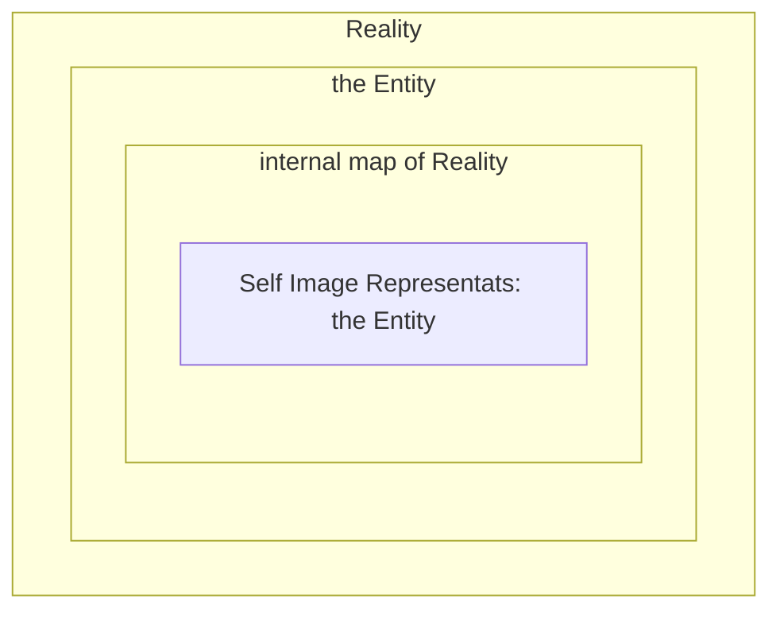
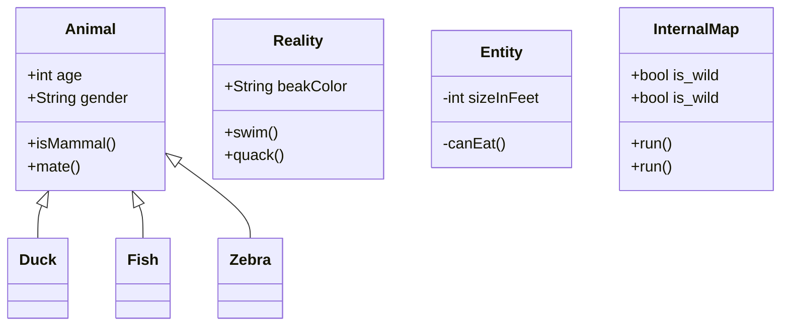

# Core Model – TrueProsperity

```mermaid
graph TD

subgraph Reality["Reality"]
    subgraph Entity["the Entity"]
        subgraph map["internal map of Reality"]
            self_image["Self Image Representats: the Entity"]
	    end
  end
end
```

```mermaid
classDiagram
    Animal <|-- Duck
    Animal <|-- Fish
    Animal <|-- Zebra
    Animal : +int age
    Animal : +String gender
    Animal: +isMammal()
    Animal: +mate()
    class Reality{
      +String beakColor
      +swim()
      +quack()
    }
    class Entity{
      -int sizeInFeet
      -canEat()
    }
    class InternalMap{
      +bool is_wild
      +run()
    }
    class InternalMap{
      +bool is_wild
      +run()
    }
```