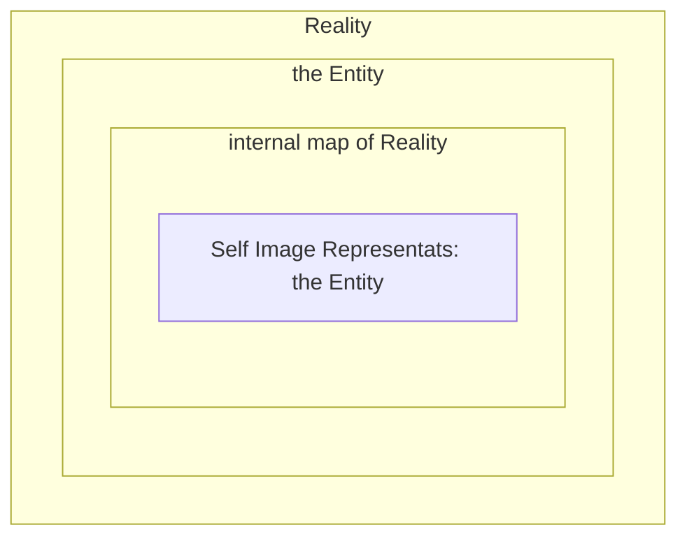
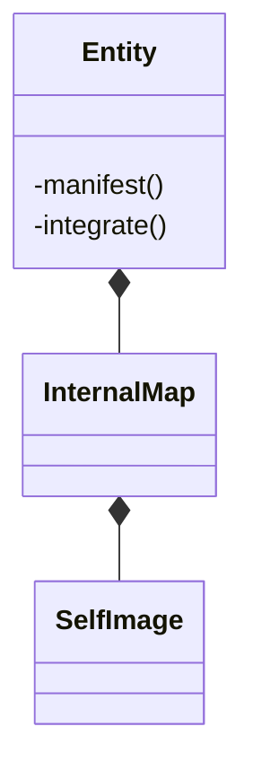

# Core Model – TrueProsperity

Reality is not a class.
Reality is where all classes exist.

to manifest something is to take it from the internal map and change things in reality. i.e. manifest from internal map to Reality
to integrate something is let reality update the internal map

